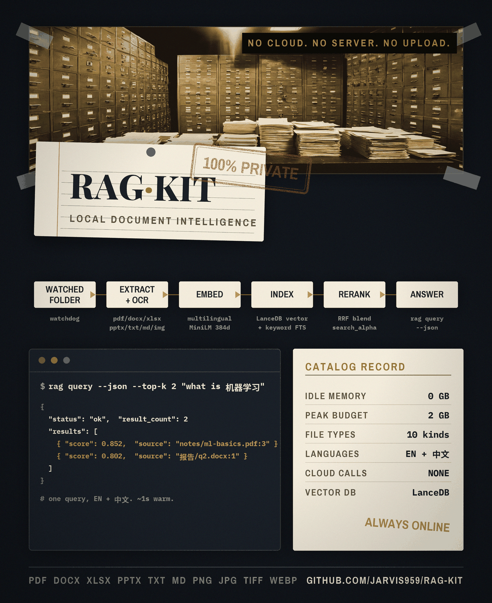

# rag-kit

Lightweight agentic RAG system for Hermes Agent. Watches a folder, auto-ingests documents (PDF, DOCX, XLSX, PPTX, TXT, MD, and images via OCR), embeds with a multilingual sentence-transformers model, stores in LanceDB, and answers via a CLI designed for LLM agents. Designed to be incredibly easy to set up as a superior option to semantic recall. Models are pinned to ensure compatability. RAM usage: 0GB at idle, ~2GB at peak.

## Quickstart (one-liner per platform)

```bash
# Windows
scripts\install-windows.bat

# Linux / DGX Spark
chmod +x scripts/install-dgx-spark.sh && ./scripts/install-dgx-spark.sh
```

That's it. The installer creates a venv at `~/rag-kit-venv/`, installs everything, starts the watcher, and optionally sets up autostart.

## Offline model files

These steps transfer model weights only. A fresh installation still needs internet access for Python dependencies (including PyTorch); the installers do not bundle a wheelhouse. Install dependencies online before moving to an offline machine, or prepare a platform-compatible dependency bundle separately.

1. Download models first (on a machine with internet):
   ```bash
   # Windows
   scripts\download-models.bat

   # Linux
   chmod +x scripts/download-models.sh && ./scripts/download-models.sh
   ```

2. Copy `~/models/` to a machine where rag-kit and its Python dependencies are already installed. Cached-model operation can then run offline; copying model files alone does not make installation offline.

## Features

- **Auto-ingest**: Watches a folder (event-based via watchdog); new, changed, and **deleted** files are handled — removing a file also removes its vectors (delete-sync)
- **Full document coverage**: PDF (incl. scanned, via OCR), DOCX, XLSX, PPTX, TXT, MD, and images (PNG, JPG, TIFF, WEBP)
- **Multilingual**: Chinese + English text extraction, chunking, and embeddings
- **OCR fallback**: EasyOCR for scanned PDFs and image-based documents
- **VLM captioning**: SmolVLM-256M for charts and diagrams (optional, configurable)
- **Hybrid search**: Semantic (vector) + keyword (FTS) scoring blended with an RRF reranker, tuned via `search_alpha`
- **Local vector DB**: LanceDB — no server, no external dependencies
- **Agent-friendly**: All CLI commands support `--json` output for Hermes Agent
- **2 GB budget**: Total model memory (embedding + OCR + VLM) fits within 2 GB
- **Cross-platform**: Windows + Linux (DGX Spark ARM64)
- **Autostart**: Windows Scheduled Task or Linux systemd user service on boot

## CLI Reference

| Command | Description | JSON flag |
| `rag ingest <path>` | Ingest a file or folder | `--json` |
| `rag query "<text>"` | Hybrid search (vector + keyword) | `--json` |
| `rag list-files` | List all ingested files | `--json` |
| `rag delete <path>` | Remove a file's chunks from DB | `--json` |
| `rag status` | Show system status and model info | `--json` |
| `rag watch <folder>` | Start real-time folder watcher | `--json` |
| `rag setup-autostart` | Configure autostart (boot) | `--json` |
| `rag config` | Print or update configuration | — |
| `rag config init` | Create default config file | — |
| `rag config path` | Show config file location | — |
| `rag config set <key> <value>` | Update a config value | — |
| `rag --version` | Show version | — |

### JSON output examples

```bash
# Search (agent consumption)
rag query --json "机器学习是什么" --top-k 5

# System status
rag status --json

# List files
rag list-files --json

# Setup autostart
rag setup-autostart --json
```

## Configuration

rag-kit loads config from (in order of precedence):

1. `RAG_KIT_CONFIG` environment variable (path to a YAML file)
2. `./rag-kit.yaml` (current directory)
3. `~/.rag-kit.yaml` (user home)

Every config key can be overridden via environment variable `RAG_KIT_<KEY>`:

```bash
export RAG_KIT_WATCH_FOLDER=~/my-documents
export RAG_KIT_DB_PATH=~/my-lancedb
export RAG_KIT_VLM_ENABLED=false
export RAG_KIT_HF_ENDPOINT=https://hf-mirror.com   # China mirror
```

### Config file reference

| Key | Type | Default | Description |
| `watch_folder` | path | `~/Documents/rag-ingest` | Folder the watcher monitors |
| `db_path` | path | `~/lancedb` | LanceDB storage directory |
| `model_dir` | path | `~/models` | Model cache directory |
| `embedding_model` | str | `paraphrase-multilingual-MiniLM-L12-v2` | Sentence-transformers model |
| `vlm_model` | str | `HuggingFaceTB/SmolVLM-256M-Instruct` | VLM model for captions |
| `vlm_enabled` | bool | `true` | Enable VLM captioning |
| `supported_extensions` | list | `[.pdf, .docx, .xlsx, .pptx, .txt, .md, .png, .jpg, .jpeg, .tiff, .webp]` | File types to ingest |
| `languages` | list | `[zh, en]` | OCR languages |
| `chunk_size` | int | `512` | Target chunk length (chars) |
| `chunk_overlap` | int | `64` | Overlap between chunks |
| `watch_interval` | int | `30` | Reserved. Watcher is state-change based (watchdog) — needs no poll interval |
| `search_alpha` | float | `0.5` | Semantic vs keyword blend |
| `max_memory_mb` | int | `2048` | Memory budget guard |
| `hf_endpoint` | str | `""` | HF endpoint (set for China) |

### Models

| Component | Model | Disk | Runtime RAM |
|---|---|---|---|
| Embedding | paraphrase-multilingual-MiniLM-L12-v2 | ~470 MB | ~500 MB |
| OCR | EasyOCR (zh+en) | ~100 MB download | ~500 MB |
| VLM | SmolVLM-256M-Instruct | ~500 MB | ~500 MB |
| **Total** | | **~1.1 GB** | **~1.5 GB (< 2 GB)** |

> Model weights are version-locked: `scripts/download-models.*` fetch pinned tarballs from the **v0.1.0** release, independent of the app version. They are only re-uploaded when the model set itself changes. All bundled weights are Apache-2.0 and re-distributed with attribution — see [THIRD_PARTY_NOTICES.md](THIRD_PARTY_NOTICES.md).

## Hermes Agent Integration

rag-kit includes a SKILL.md that teaches Hermes Agent to use `rag query --json` instead of `web_search` when the user asks about "my documents", "search my data", or "the database".

The installer copies the skill to `~/.hermes/skills/research/rag-kit/SKILL.md`. After installation, Hermes Agent will:
- Detect queries about local documents
- Run `rag query --json --top-k 5 "query"`
- Present results with source attribution

## Testing

```bash
cd rag-kit

# Full suite: CLI integration and VLM tests require locally cached models.
# Autostart tests change OS startup settings; run those only in a disposable environment.
python -m pytest tests/ -v

# Storage/extraction regressions: no model downloads or autostart changes.
python -m pytest tests/test_document_lifecycle.py tests/test_watchlock.py tests/test_new_features.py -q

# Run a specific module
python -m pytest tests/test_rag_pipeline.py -v   # core pipeline + version check
python -m pytest tests/test_ingest_pipeline.py -v
python -m pytest tests/test_new_features.py -v   # xlsx/pptx/images, hybrid search, delete-sync
python -m pytest tests/test_watchlock.py -v      # single-instance watcher lock
python -m pytest tests/test_cli.py -v
python -m pytest tests/test_embed_store.py -v
python -m pytest tests/test_vlm.py -v
```

## Troubleshooting

### Partial visual extraction

Re-ingestion is all-or-nothing for each source. If enabled visual extraction fails or produces incomplete captions, **all previous chunks for that source, including visual chunks, are retained**. Text changes from that attempt are not committed. New sources with incomplete extraction are not stored. CLI JSON reports `status: partial`, nonempty `errors`, and exits with code 1; watcher JSON emits `ingest_failed` with `status: partial` and `source_replaced: false`. Fix model availability and re-ingest. A successfully extracted empty document still removes its previous chunks. Explicitly disabling VLM opts into a text-only replacement.

Visual-region discovery, PDF rendering, and DOCX image-read failures also make extraction incomplete. A failed PDF page render can still succeed when every required visual region is recovered as opaque embedded raster images. Raster recovery cannot substitute for vectors, inline images, masks, annotations, or form widgets. Blank PDF pages and short native text without visual content require no OCR or VLM model. Scanned pages and visible form controls still require successful extraction.

With `search_alpha: 0`, keyword-only queries do not construct or load an embedding model.

### "ModuleNotFoundError" or import errors
```bash
# Ensure you're in the right venv
source ~/rag-kit-venv/bin/activate       # Linux
~\rag-kit-venv\Scripts\activate.bat      # Windows
```

### "HF_HUB_OFFLINE=1 but model not cached"
```bash
# Pre-download models first
scripts/download-models.bat   # Windows
# or
# Set China mirror
export HF_ENDPOINT=https://hf-mirror.com
```

### "Permission denied" on setup-autostart (Windows)
Run as Administrator or skip autostart — the watcher can be started manually:
```bash
rag watch ~\Documents\rag-ingest
```

### Watcher not running
```bash
# Check watcher status
rag status

# Start manually
rag watch ~/Documents/rag-ingest &

# Check autostart
rag setup-autostart --json
```

### Empty query results
```bash
# Check if documents were ingested
rag list-files --json

# Re-ingest
rag ingest ~/Documents/rag-ingest
```

## Requirements

- Python 3.10+
- 4 GB RAM recommended (2 GB minimum for models)
- ~2 GB disk for models + documents
- NVIDIA GPU optional (CPU-only supported)

## Platforms

| Platform | Install Script | Autostart |
|---|---|---|
| Windows 10/11 | `scripts\install-windows.bat` | schtasks |
| Linux (x86_64) | `scripts/install-dgx-spark.sh` | systemd user service |
| Linux (DGX Spark ARM64) | `scripts/install-dgx-spark.sh` | systemd user service |

## Changelog

### Unreleased — document lifecycle fixes

- Re-importing a document atomically replaces its previous chunks. Empty documents remove previous content; extraction and embedding failures retain it.
- All text and visual chunks share a resolved source path and consistent page numbering. Windows CLI output uses UTF-8 when captured by agents.
- An explicit `RAG_KIT_CONFIG` path is respected even before the file exists, so creating a separate config does not edit the user's default config.
- Watch startup reconciles changes made while stopped. File and directory moves/deletions remove old sources; moves outside the watched folder are not ingested.
- Watcher ownership uses an OS file lock, released when the process exits. Lock files remain on disk and are safe to reuse.
- Existing indexes gain missing metadata columns without dropping documents. Changing embedding dimensions requires a separate database.
- Long-lived database readers see commits from other processes, including watcher updates; queries tolerate a first ingestion that is still creating its table.
- `search_alpha` weights reciprocal-rank fusion and retains zero for keyword-only search, including source-filtered queries. LanceDB 0.25+ is required for native full-text indexing.
- Cached sentence-transformers snapshots load directly, including short model names in the standard namespaced Hub cache.

New imports replace sources stored under the same absolute path. Older releases may have left relative paths or basename-only visual chunks; review `rag list-files --json` and remove those obsolete source entries explicitly after re-importing. Basename-only entries cannot be safely assigned to a document when several files share a name.

### v0.1.1 — RAG overhaul

- **Hybrid search**: FTS + RRF reranker now blended into `rag query`, tuned via `search_alpha`; store dimension derived from the embedding model instead of hardcoded
- **Delete-sync**: sources stored as full resolved paths, so `rag delete` and watcher-handled deletions remove the correct rows (was basename-only)
- **Watcher**: event-based (watchdog) with a per-folder single-instance lock; handles create / modify / move / delete
- **Formats**: recursive folder ingest; new **XLSX** (openpyxl), **PPTX** (python-pptx), and **image** (EasyOCR) support
- **VLM**: dead ONNX provider kwarg removed; no more double-captioning
- **Offline**: `HF_HUB_OFFLINE` set only when models are cached; autostart runs `rag watch`; systemd linger uses `getpass`
- **Installers**: install deps, start the watcher (lock-safe), initial backfill, optional pinned-model pre-download
- **Docs**: README, SKILL, and example config updated to match

### v0.1.0 — Initial release

- First release: watch, ingest (PDF / DOCX / TXT / MD), embed, query
- Pinned model weights shipped as GitHub release assets (embedding, EasyOCR, SmolVLM) with size + gzip integrity checks

## License

MIT
